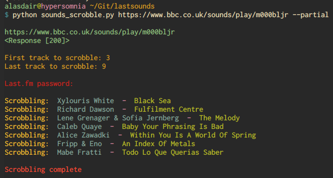

# Lastsounds

Scrobble tracks from a BBC Sounds episode to Last.fm via the command line. The application takes a URL for a BBC Sounds episode as an argument and scrobbles the tracks assuming the user finished listening at runtime. 

Basic usage -

`python sounds_scrobble.py [OPTIONS] [URL]`

**Note**: If Python 3 is not the default on your system you'll need to enter `python3 ...` instead.

By default, lastsounds scrobbles all tracks from the episode. To scrobble only a range of tracks, pass the option `--partial` or `-p` when running the command - 

`python sounds_scrobble.py --partial [URL]`

## Dependencies

Lastsounds depends on BeautifulSoup, Click, Requests, Colorama, and pylast.

All dependencies can be installed using [pipenv](https://pipenv.kennethreitz.org/en/latest/) by running `pipenv install` in the git repository.

## Setup

Lastsounds requires an API key & a shared secret that are specific to your account. These can be created [here](www.last.fm/api/account/create). Only the "Application name" field needs to be filled and the rest can be left blank. 

After creating the key and secret, create a copy of `details` and rename it to `.details`. Then add your API key, shared secret, and username to it.
